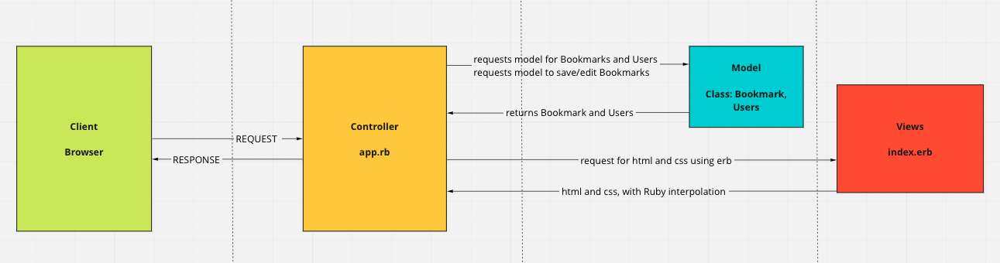

# Bookmark Manager

## Specification

- Show a list of bookmarks
- Add new bookmarks
- Delete bookmarks
- Update bookmarks
- Comment on bookmarks
- Tag bookmarks into categories
- Filter bookmarks by tag
- Users are restricted to manage only their own bookmarks

## User Stories

As a user
So that I can see all my bookmarks
I'd like to see a list of my bookmarks.

As a user
So that I can see all my bookmarks
I'd like to add a new bookmark.

As a user
So that I can edit my bookmarks
I'd like to be able to delete bookmarks.

As a user
So that I can edit my bookmarks
I'd like to be able to update bookmarks.

As a user
So that I can add additional information
I'd like to comment on bookmarks.

As a user
So that I can organise my bookmarks
I'd like to be able to tag bookmarks into categories.

As a user
So that I can find relevant bookmarks
I'd like to be able to filter bookmarks by tag.

As a manager
So that I can prevent users from accessing other users bookmarks
I'd like to be able to restrict users to manage only their own bookmarks.

## Domain Modelling 

